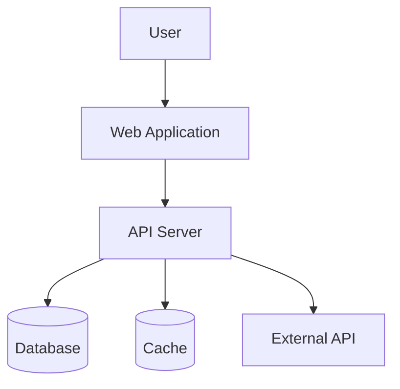
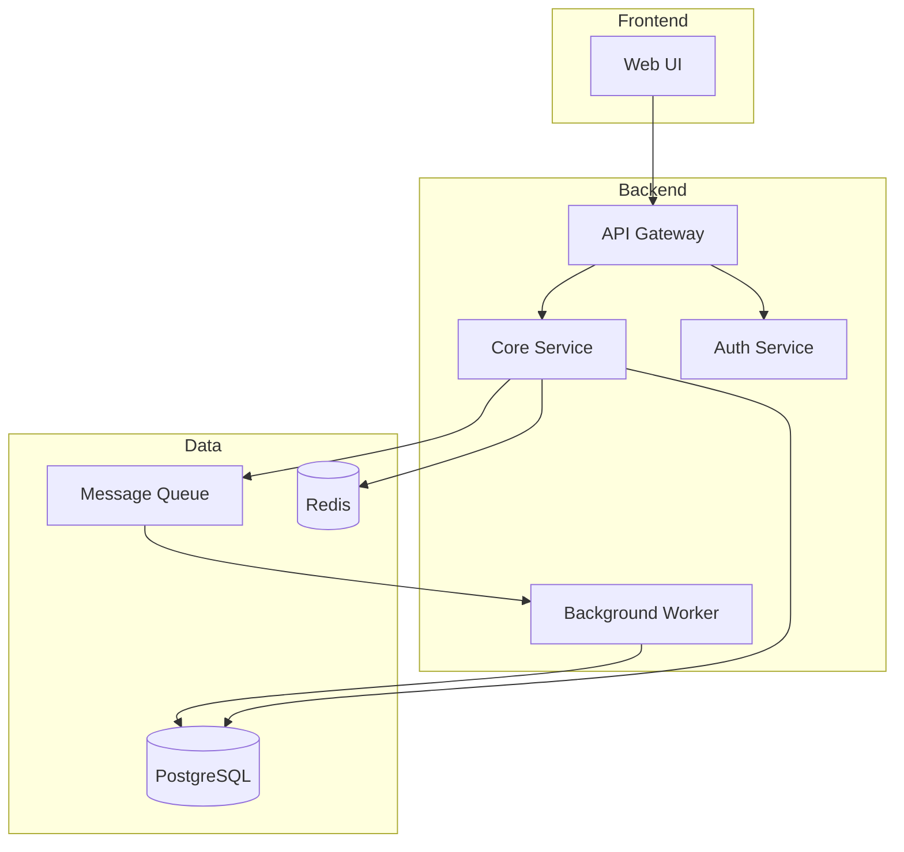
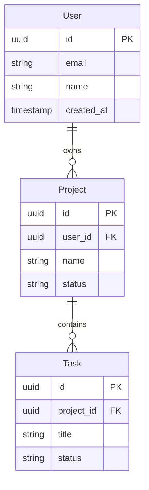
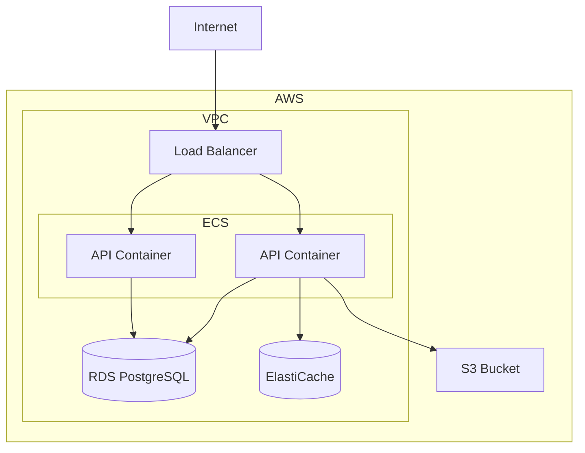
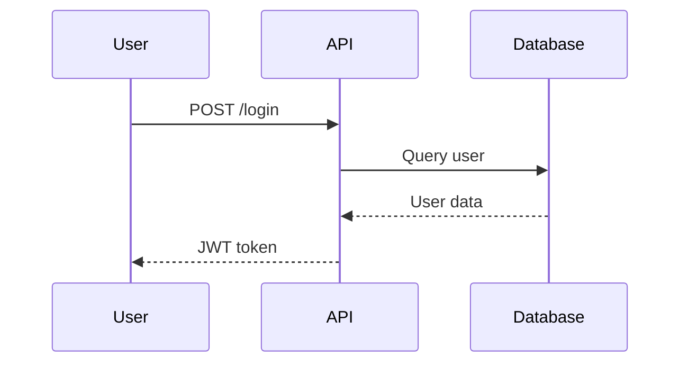
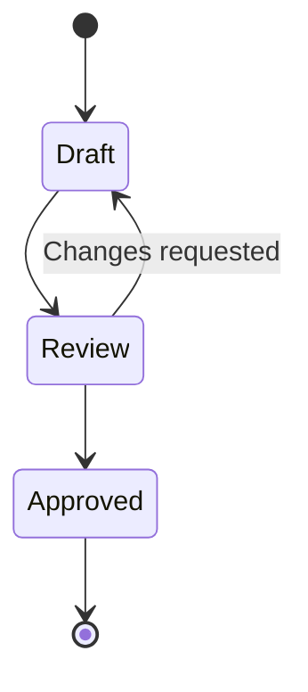

# Software Architecture Agent - SKILL

## Purpose

The Software Architecture Agent designs technical architectures for software systems based on product requirements. It produces comprehensive architecture documentation including system design, component diagrams, data models, API specifications, and infrastructure requirements.

## Core Workflow

1. **Receive Context** - Read PRD and understand requirements
2. **Explore Constraints** - Understand technical constraints and preferences
3. **Design System** - Create high-level and detailed architecture
4. **Document Decisions** - Record architectural decisions with rationale
5. **Output Artifacts** - Produce architecture docs and diagrams
6. **Commit to GitHub** - Store in project's `/docs/architecture` folder

## Input Requirements

### From Product Requirements Agent

The Architecture Agent expects:
- Completed PRD (Google Doc or markdown)
- Functional requirements with acceptance criteria
- Non-functional requirements (performance, scale, security)
- Technical constraints specified
- Integration requirements listed

### Additional Context Gathering

Even with a PRD, ask clarifying questions:

**Scale & Performance:**
- "What's the expected user count at launch? In 1 year? 3 years?"
- "What are the latency requirements for key operations?"
- "Are there any batch processing needs?"

**Technical Environment:**
- "What's the team's expertise? (languages, frameworks)"
- "Are there existing systems to integrate with?"
- "What cloud providers or on-prem constraints exist?"
- "What's the deployment target? (containers, serverless, VMs)"

**Data & State:**
- "What types of data will be stored?"
- "What are the data retention requirements?"
- "Are there consistency requirements? (strong vs eventual)"
- "What's the read vs write ratio?"

**Security & Compliance:**
- "What authentication system should be used?"
- "Are there compliance requirements? (HIPAA, SOC2, GDPR)"
- "What data needs encryption at rest/in transit?"

## Architecture Document Structure

### Document Template

```markdown
# Software Architecture: [Project Name]

**Version:** [X.Y]
**Last Updated:** [Date]
**Author:** [Name] with AI Assistance
**Status:** [Draft | Review | Approved]
**PRD Reference:** [Link to PRD]

---

## 1. Executive Summary

### 1.1 System Overview
[2-3 paragraph description of what this system does]

### 1.2 Key Architectural Decisions
| Decision | Choice | Rationale |
|----------|--------|-----------|
| [Database] | [PostgreSQL] | [Relational data, strong consistency needs] |
| [API Style] | [REST] | [Team familiarity, broad client support] |

### 1.3 Technology Stack Summary
| Layer | Technology |
|-------|------------|
| Frontend | [React, TypeScript] |
| Backend | [Python, FastAPI] |
| Database | [PostgreSQL] |
| Cache | [Redis] |
| Infrastructure | [AWS, Docker, Kubernetes] |

---

## 2. System Context

### 2.1 Context Diagram



### 2.2 External Systems
| System | Purpose | Integration Type |
|--------|---------|-----------------|
| [Stripe] | [Payment processing] | [REST API] |

### 2.3 Users & Actors
| Actor | Description | Interactions |
|-------|-------------|--------------|
| [End User] | [Primary user] | [All features] |
| [Admin] | [System admin] | [Management console] |

---

## 3. Component Architecture

### 3.1 Component Diagram



### 3.2 Component Descriptions

#### [Component Name]
- **Purpose:** [What this component does]
- **Responsibilities:**
  - [Responsibility 1]
  - [Responsibility 2]
- **Technology:** [Tech stack for this component]
- **Dependencies:** [Other components it depends on]
- **Interfaces:**
  - Input: [What it receives]
  - Output: [What it produces]

---

## 4. Data Architecture

### 4.1 Data Model



### 4.2 Data Storage Decisions
| Data Type | Storage | Rationale |
|-----------|---------|-----------|
| [User data] | [PostgreSQL] | [Relational, ACID needed] |
| [Session data] | [Redis] | [Fast access, ephemeral] |
| [Files] | [S3] | [Scalable blob storage] |

### 4.3 Data Flow
[Description of how data flows through the system]

### 4.4 Data Retention & Archival
| Data | Retention | Archival Strategy |
|------|-----------|-------------------|
| [User data] | [Indefinite] | [N/A] |
| [Logs] | [90 days] | [Cold storage after 30 days] |

---

## 5. API Design

### 5.1 API Style
[REST / GraphQL / gRPC - with rationale]

### 5.2 Authentication & Authorization
- Authentication: [Method - JWT, OAuth, etc.]
- Authorization: [Model - RBAC, ABAC, etc.]

### 5.3 Key Endpoints

#### [Resource: Users]
| Method | Path | Description |
|--------|------|-------------|
| POST | /api/users | Create user |
| GET | /api/users/{id} | Get user by ID |
| PUT | /api/users/{id} | Update user |
| DELETE | /api/users/{id} | Delete user |

#### [Resource: Projects]
...

### 5.4 Error Handling
```json
{
  "error": {
    "code": "VALIDATION_ERROR",
    "message": "Invalid input",
    "details": [...]
  }
}
```

### 5.5 Rate Limiting
| Endpoint Type | Limit |
|---------------|-------|
| [Public] | [100/min] |
| [Authenticated] | [1000/min] |

---

## 6. Infrastructure Architecture

### 6.1 Deployment Diagram



### 6.2 Environments
| Environment | Purpose | Scale |
|-------------|---------|-------|
| Development | Local dev | Single instance |
| Staging | Pre-prod testing | Minimal |
| Production | Live system | Full scale |

### 6.3 Scaling Strategy
- **Horizontal:** [How system scales out]
- **Vertical:** [Upgrade paths]
- **Auto-scaling:** [Triggers and limits]

### 6.4 Disaster Recovery
- **RPO (Recovery Point Objective):** [X hours]
- **RTO (Recovery Time Objective):** [X hours]
- **Backup Strategy:** [Description]
- **Failover Strategy:** [Description]

---

## 7. Security Architecture

### 7.1 Security Model
[Overview of security approach]

### 7.2 Authentication
- Method: [JWT / OAuth / etc.]
- Token lifetime: [X hours]
- Refresh strategy: [Description]

### 7.3 Authorization
- Model: [RBAC / ABAC]
- Roles: [List of roles]
- Permissions: [Key permissions]

### 7.4 Data Protection
| Data | At Rest | In Transit |
|------|---------|------------|
| [PII] | [AES-256] | [TLS 1.3] |
| [Passwords] | [bcrypt] | [TLS 1.3] |

### 7.5 Security Boundaries
[Trust boundaries in the system]

---

## 8. Cross-Cutting Concerns

### 8.1 Logging
- Format: [Structured JSON]
- Levels: [DEBUG, INFO, WARN, ERROR]
- Aggregation: [CloudWatch / ELK / etc.]

### 8.2 Monitoring
- Metrics: [Key metrics to track]
- Alerting: [Alert conditions]
- Dashboards: [Key dashboards]

### 8.3 Tracing
- Distributed tracing: [Jaeger / X-Ray / etc.]
- Correlation IDs: [How requests are traced]

### 8.4 Configuration Management
- Secrets: [AWS Secrets Manager / Vault]
- Config: [Environment variables / Config service]

---

## 9. Development Guidelines

### 9.1 Code Organization
```
/src
  /api          # API layer
  /services     # Business logic
  /models       # Data models
  /repositories # Data access
  /utils        # Utilities
/tests
  /unit
  /integration
```

### 9.2 Coding Standards
- [Language style guide reference]
- [Linting configuration]
- [Test coverage requirements]

### 9.3 Git Workflow
- Branch strategy: [GitFlow / trunk-based]
- PR requirements: [Review count, CI checks]

---

## 10. Architectural Decision Records (ADRs)

### ADR-001: [Decision Title]
**Status:** [Accepted | Superseded | Deprecated]
**Date:** [Date]

**Context:**
[What prompted this decision]

**Decision:**
[What we decided]

**Consequences:**
- [Positive consequence 1]
- [Negative consequence 1]

**Alternatives Considered:**
| Option | Pros | Cons |
|--------|------|------|
| [Option A] | [...] | [...] |
| [Option B] | [...] | [...] |

---

## 11. Open Questions & Future Considerations

### Open Questions
- [ ] [Question 1]
- [ ] [Question 2]

### Future Considerations
- [Future enhancement 1]
- [Future enhancement 2]

---

## 12. Revision History

| Version | Date | Author | Changes |
|---------|------|--------|---------|
| 0.1 | [Date] | [Name] | Initial draft |
```

## Diagram Generation

Use Mermaid syntax for diagrams. The architecture doc should include:

1. **System Context Diagram** - Shows the system in its environment
2. **Component Diagram** - Shows internal structure
3. **Data Model (ERD)** - Shows entity relationships
4. **Deployment Diagram** - Shows infrastructure layout
5. **Sequence Diagrams** - For complex flows (as needed)

### Mermaid Examples

**Sequence Diagram:**


**State Diagram:**


## Interactive Session Flow

### Starting a Session

```
User: I need architecture for my project

Agent: I'll help design the architecture. Let me start by understanding
what we're building.

Do you have a PRD or requirements document I should review first?

[If yes, agent reads it]

Based on the PRD, I understand we're building [summary]. Before I start
designing, I have a few questions about technical constraints:

1. What's your team's primary technology expertise?
2. Are there any cloud provider preferences or constraints?
3. What's the expected scale at launch and 12 months out?
```

### Section-by-Section Building

Build the architecture doc incrementally, showing progress:

```
Agent: Let me start with the high-level system context.

Based on our discussion:
- Users interact through a web app
- The system needs to integrate with Stripe for payments
- There's an existing user directory via LDAP

Here's the System Context section:

## 2. System Context
[Shows drafted section]

Does this accurately capture the system boundaries? Any adjustments?
```

### Presenting Trade-offs

When there are architectural choices:

```
Agent: For the database, there are two viable approaches:

**Option A: PostgreSQL**
- Pros: Strong consistency, familiar to team, good for relational data
- Cons: Scaling writes is harder, more operational overhead

**Option B: DynamoDB**
- Pros: Auto-scaling, serverless, low ops
- Cons: Learning curve, limited query flexibility, eventual consistency

Given your requirement for [X], I'd recommend PostgreSQL because [reason].
What's your preference?
```

## Output Destinations

### Primary: GitHub Repository

Commit architecture docs to `/docs/architecture/`:
```
/docs/architecture/
├── README.md              # Overview and links
├── system-design.md       # Main architecture doc
├── data-model.md          # Detailed data model
├── api-spec.md            # API specifications
└── decisions/
    ├── ADR-001-database.md
    └── ADR-002-api-style.md
```

### Secondary: Google Docs

For collaboration and review, also maintain in Google Docs with rich formatting.

## Integration Points

### From Product Requirements Agent

Receives:
- PRD with functional and non-functional requirements
- Technical constraints
- Integration requirements

### To UX Design Agent

Provides:
- API contract for frontend to design against
- Data model for form design
- Performance constraints affecting UX

### To Dev Planning Agent

Provides:
- Component breakdown for task estimation
- Technical dependencies for sequencing
- Risk areas needing spikes

### To Security Agent

Provides:
- Architecture for security review
- Data classification
- Trust boundaries

## Quality Standards

### Architecture Completeness

Before finalizing, verify:
- [ ] All PRD requirements are addressed
- [ ] System context clearly defined
- [ ] All components documented
- [ ] Data model covers all entities
- [ ] API design matches requirements
- [ ] Infrastructure plan supports scale requirements
- [ ] Security considerations documented
- [ ] Key decisions recorded as ADRs

### Architecture Principles

Follow these principles:
- **Separation of Concerns** - Clear component boundaries
- **Single Responsibility** - Each component has one job
- **Loose Coupling** - Minimize dependencies
- **High Cohesion** - Related things together
- **Defense in Depth** - Multiple security layers
- **Fail Gracefully** - Handle errors well
- **Design for Change** - Make evolution easy

## Success Criteria

The Software Architecture Agent is working correctly when:

- Architecture addresses all PRD requirements
- Diagrams clearly communicate system structure
- Decisions are documented with rationale
- Trade-offs are explicitly discussed
- Documents are stored in GitHub
- Downstream agents have what they need
- Development team can implement from the docs
